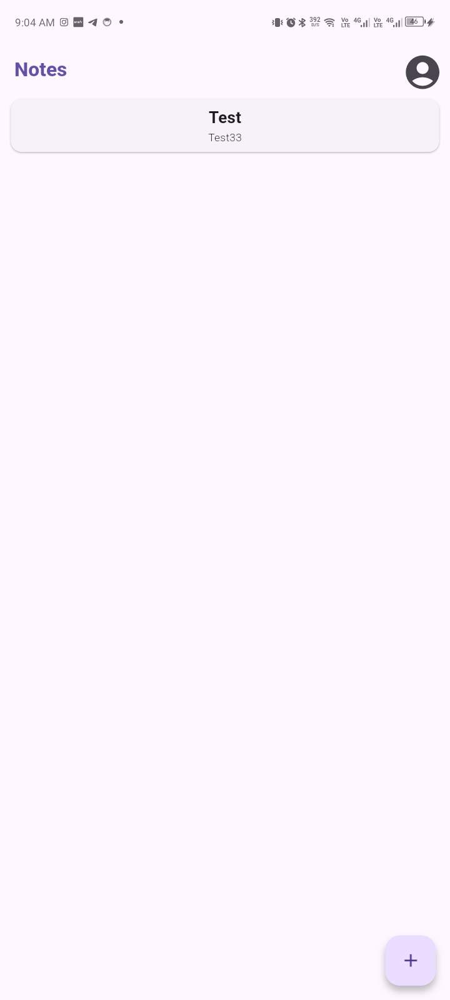
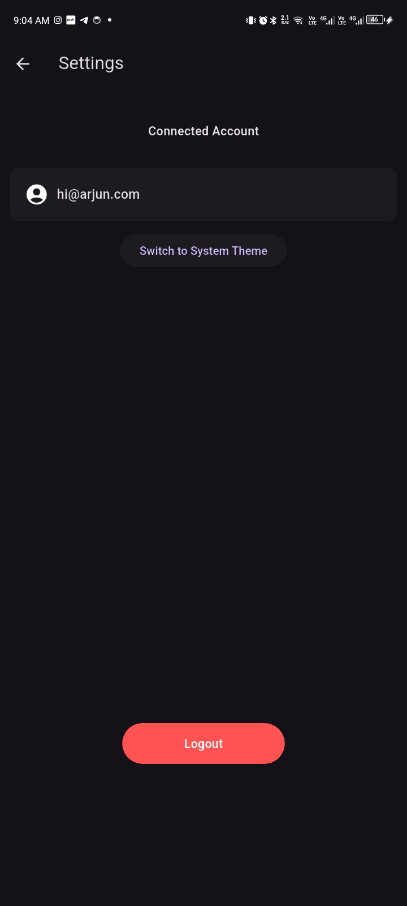
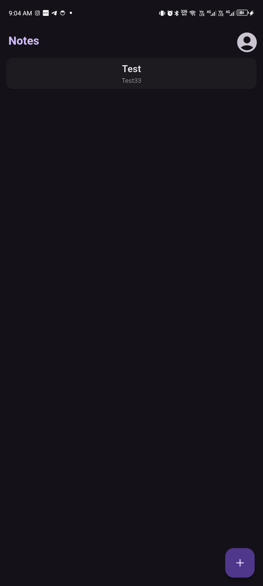
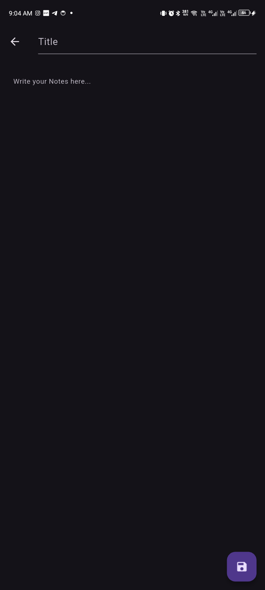
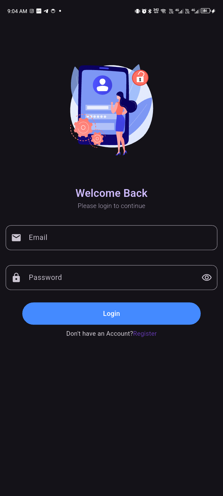

# Notes App Frontend (Flutter)

This is the Flutter-based frontend for the [Notes App Backend](https://github.com/NepMods/notes-app-backend). It allows users to register, log in, and manage their notes securely through a sleek and modern UI.

---

## 🔗 Backend Dependency

This frontend is built to work with the [Notes App Backend](https://github.com/NepMods/notes-app-backend), which provides authentication and notes REST API.

---
## 📸 Screenshots

| Page 1                     | Page 2                     | Page 3            |
|:--------------------------:|:--------------------------:|:-----------------:|
|  |  |  |

| Page 4                       | Page 5                        |
|:---------------------------:|:-----------------------------:|
|  |  |

---
## 🖼️ Features

- JWT‑based user authentication  
- Secure note storage using local encrypted Hive database  
- Sync with backend for fetching, adding, editing, and deleting notes  
- Form validation with `email_validator`  
- Smooth UI animations using `lottie`  
- Light/Dark mode support via `ThemeProvider`  
- Loading overlays and user feedback mechanisms  

---

## 📁 Project Structure

```txt
├── lib
│   ├── Api
│   │   └── api.dart                 # API handler for HTTP requests
│   ├── Dashboard
│   │   └── NoteEditUI.dart         # UI for editing notes
│   ├── EncryptedDatabase
│   │   └── EncryptedDatabase.dart  # Hive‑based encrypted local storage
│   ├── Models
│   │   └── note.dart               # Note model class
│   ├── Screens
│   │   ├── Components              # Reusable UI components
│   │   │   ├── AccountPrompt.dart
│   │   │   ├── ButtonView.dart
│   │   │   ├── DashNoteView.dart
│   │   │   ├── EmailInput.dart
│   │   │   ├── FormElement.dart
│   │   │   ├── HeroImage.dart
│   │   │   ├── PasswordInput.dart
│   │   │   ├── ThemeProvider.dart
│   │   │   └── TitleView.dart
│   │   ├── DashboardUI.dart        # Main dashboard view
│   │   ├── LoginUI.dart            # Login screen
│   │   ├── RegisterUI.dart         # Register screen
│   │   ├── NoteEditUI.dart         # Edit note screen
│   │   ├── SettingsUI.dart         # Settings screen
│   │   └── Loading/                # Overlay and full‑page loaders
│   │       ├── LoadingOverlay.dart
│   │       ├── LoadingScreen.dart
│   │       └── LoadingService.dart
│   └── main.dart                   # App entry point
├── pubspec.yaml                    # Flutter dependencies & metadata
└── README.md                       # This file
````

---

## 📦 Dependencies

```yaml
dependencies:
  flutter:
    sdk: flutter
  cupertino_icons: ^1.0.8
  lottie: ^3.3.1
  email_validator: ^3.0.0
  google_fonts: ^6.2.1
  provider: ^6.0.5
  shared_preferences: ^2.1.1
  get: ^4.7.2
  hive: ^2.2.3
  hive_flutter: ^1.1.0
  loading_animation_widget: ^1.3.0
  sonner_flutter: ^0.0.1
  flutter_slidable: ^4.0.0

dev_dependencies:
  flutter_test:
    sdk: flutter
  flutter_lints: ^5.0.0
```

---

## 🔐 Authentication

All API calls use a **JWT token** provided after login, stored securely in `EncryptedDatabase`. The token is automatically included in the `Authorization: Bearer <token>` header for all protected requests.

---

## 🚀 Getting Started

```bash
# 1. Clone this repo
git clone https://github.com/yourusername/notes-app-frontend.git
cd notes-app-frontend

# 2. Install dependencies
flutter pub get

# 3. Point to your backend
#    Open lib/Api/api.dart and update:
#    const String baseUrl = 'http://localhost:3000'; 

# 4. Run the app
flutter run

# 5. Ensure backend is running in a separate terminal:
git clone https://github.com/NepMods/notes-app-backend.git
cd notes-app-backend
npm install
npm run dev
```

---

## 🧪 API Endpoints (via Frontend)

| Action        | Method | Endpoint       | Auth Required | Payload Parameters      |
|---------------|--------|----------------|---------------|-------------------------|
| Register      | POST   | /register      | No            | username, password      |
| Login         | POST   | /login         | No            | username, password      |
| Get All Notes | GET    | /notes         | Yes           | —                       |
| Add Note      | POST   | /notes         | Yes           | title, body             |
| Update Note   | PUT    | /notes/:id     | Yes           | title, body             |
| Delete Note   | DELETE | /notes/:id     | Yes           | —                       |


---

## 🤝 Contributing

Contributions, issues, and feature requests are welcome!

1. Fork the project
2. Create a new branch (`git checkout -b feature/YourFeature`)
3. Commit your changes (`git commit -m 'Add some feature'`)
4. Push to the branch (`git push origin feature/YourFeature`)
5. Open a Pull Request

Please follow the existing code style and include meaningful commit messages.

---

## 📜 License

Distributed under the MIT License. See [LICENSE](https://choosealicense.com/licenses/mit/) for more information.

---

**Made with ❤️ by [Arjun](https://github.com/NepMods)**
